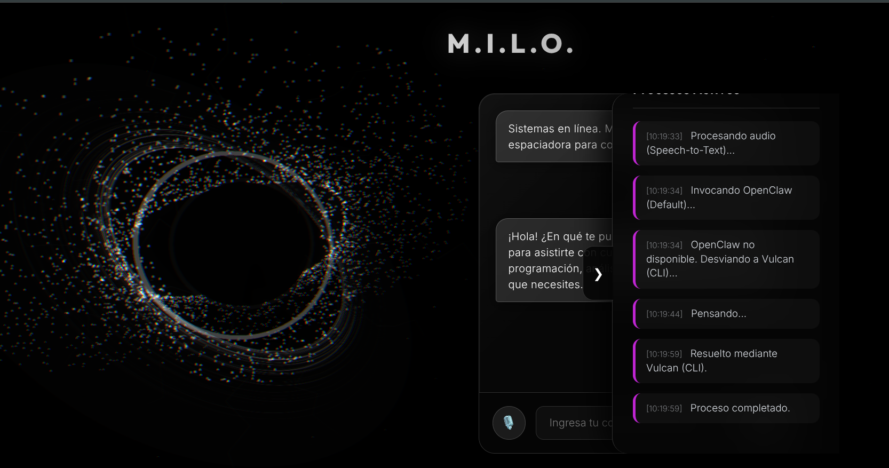

# MILO — Asistente Personal Autónomo (V2)

**MILO** es un asistente personal autónomo y resiliente (estilo Jarvis) diseñado para operar de forma eficiente, económica y persistente. Cuenta con una interfaz web interactiva que soporta conversación por texto y por voz, y está diseñado para funcionar 24/7 en servidores o localmente protegiendo el hardware y optimizando los costos.

---

## 📸 Galería de la Interfaz

Aquí puedes ver capturas de pantalla de la interfaz interactiva de MILO y su avatar 3D:




---

## 🏗️ ¿Qué es MILO?

MILO es mucho más que un simple bot de chat. Es un orquestador inteligente que integra capacidades de razonamiento, ejecución de herramientas locales y síntesis de voz interactiva en tiempo real. Sus principales características incluyen:

*   **Arquitectura de Doble Motor ("Zero API Keys")**:
    1.  **OpenClaw Gateway (Motor Principal)**: Orquestador local multi-proveedor que maneja y distribuye las consultas al motor configurado.
    2.  **Vulcan CLI / `agy` (Motor de Respaldo)**: Ejecución local autenticada con la cuenta de Google del usuario, sirviendo como fallback automático de seguridad.
*   **Avatar Sensorial 3D Interactivo**: Desarrollado con `Three.js`, presenta un núcleo tridimensional dinámico con físicas interactivas y deformación de vértices que reacciona a los estados de MILO:
    *   ⚪ **Inactivo (Blanco)**: Ondulación suave y respiración 3D.
    *   🟢 **Escuchando (Azul Verdoso)**: Movimiento vibratorio en espera de audio.
    *   🟣 **Procesando (Púrpura)**: Rotación acelerada y oscilación inquieta.
    *   🔊 **Hablando (Pulsación Reactiva)**: Expansión y deformación en tiempo real según el volumen del audio de respuesta (mediante `Web Audio API`).
*   **Procesamiento de Voz Premium**: Transcodificación de audio en tiempo real usando un binario local de `ffmpeg` con detección inteligente de contenedores de audio (.webm, .ogg, .wav, .mp3, etc.) y síntesis por voz (`gTTS` como fallback).
*   **Persistencia y Cola de Tareas**: Base de datos SQLite integrada para registrar incidentes, encolar tareas asíncronas en segundo plano, manejar estados de herramientas y autogenerar nuevas habilidades (*Skills*).
*   **Motor de Proactividad**: Generación automática de saludos e informes al iniciar sesión (ej. *"Mientras no estabas, ocurrieron 3 errores y tienes 1 tarea pendiente"*).
*   **Circuit Breaker y Resiliencia**: Mecanismo de seguridad que bloquea herramientas si fallan consecutivamente y encola peticiones en caso de saturación o límite de cuota de las APIs (Error 429).

---

## 🚀 Guía de Inicio Rápido e Instalación

Sigue estas instrucciones para hacer una instalación limpia de MILO desde cero y validar que el entorno quedó listo.

### 📋 Requisitos Previos Comunes
1. Disponer de **Python 3.10 o superior** instalado.
2. Contar con una API Key de Gemini desde [Google AI Studio](https://aistudio.google.com/) (si configuras claves directamente) o tener configurado OpenClaw/Antigravity CLI.
3. Tener `ffmpeg` disponible en el sistema si vas a usar el flujo de audio.

### ✅ Validación de la instalación
La suite de pruebas se ejecuta con:

```bash
.venv/bin/python -m pytest
```

La configuración de `pytest` excluye directorios auxiliares como `scratch/` y `node_modules/`, para que la validación se centre en el código del proyecto y no falle por scripts manuales o dependencias externas.

---

### 🐧 Instalación en Linux

Abre tu terminal y ejecuta los siguientes comandos paso a paso:

```bash
# 1. Navegar al directorio del proyecto
cd Milo

# 2. Configurar variables de entorno copiando el ejemplo
cp .env.example .env
# Nota: Abre y edita el archivo .env para configurar tus claves y puertos

# 3. Crear el entorno virtual de Python
python3 -m venv .venv

# 4. Activar el entorno virtual
source .venv/bin/activate

# 5. Actualizar pip e instalar dependencias del proyecto
pip install --upgrade pip
pip install -r requirements.txt

# 6. Ejecutar las pruebas unitarias
python -m pytest

# 7. Iniciar el servidor de FastAPI
python -m src.main
```

---

### 🪟 Instalación en Windows

Abre **PowerShell** o el **Símbolo del Sistema (CMD)** en la carpeta del proyecto:

#### Opción A: Usando PowerShell
```powershell
# 1. Configurar variables de entorno copiando el ejemplo
Copy-Item .env.example .env
# Nota: Edita el archivo .env con tu editor favorito (ej. Notepad) para colocar tus llaves.

# 2. Crear el entorno virtual de Python
python -m venv .venv

# 3. Activar el entorno virtual
.venv\Scripts\Activate.ps1

# 4. Actualizar pip e instalar las dependencias
python -m pip install --upgrade pip
pip install -r requirements.txt

# 5. Ejecutar las pruebas unitarias
python -m pytest

# 6. Ejecutar el servidor de FastAPI
python -m src.main
```

#### Opción B: Usando Símbolo del Sistema (CMD)
```cmd
:: 1. Configurar variables de entorno copiando el ejemplo
copy .env.example .env
:: Nota: Configura tu archivo .env con tus llaves antes de continuar.

:: 2. Crear el entorno virtual de Python
python -m venv .venv

:: 3. Activar el entorno virtual
.venv\Scripts\activate.bat

:: 4. Actualizar pip e instalar las dependencias
python -m pip install --upgrade pip
pip install -r requirements.txt

:: 5. Ejecutar las pruebas unitarias
python -m pytest

:: 6. Ejecutar el servidor de FastAPI
python -m src.main
```

---

## 🎮 Guía de Inicio y Uso

Una vez que el servidor se esté ejecutando (`python -m src.main`), podrás interactuar con MILO de las siguientes formas:

1.  **Interfaz Web**: Abre tu navegador web y entra a [http://localhost:8000](http://localhost:8000).
    *   **Conversación por Voz (Push-to-Talk)**: Presiona y mantén presionada la **Barra Espaciadora** (`Spacebar`) o haz clic en el botón del micrófono para hablarle a MILO. Suelta para enviar el audio.
    *   **Avatar Interactivo**: Pasa el cursor por el avatar 3D para ver cómo las partículas esquivan dinámicamente el mouse.
    *   **Consola de Telemetría**: Despliega el panel lateral para ver en tiempo real qué herramientas está usando y el estado de la cola de tareas.
2.  **Endpoints del API**:
    *   **Health Check**: Verifica el estado del servicio en `GET /health`.
    *   **Chat Directo**: Envía peticiones POST estructuradas a `/chat`.

---

## 📡 Endpoints del API

### 1. Health Check
Verifica que el servicio esté activo y respondiendo correctamente.
*   **Método**: `GET`
*   **Ruta**: `/health`
*   **Respuesta**:
    ```json
    {
      "status": "ok",
      "app": "MILO API"
    }
    ```

### 2. Interacción con MILO (Chat)
Envía un prompt de texto para que MILO analice y ejecute herramientas localmente de forma autónoma.
*   **Método**: `POST`
*   **Ruta**: `/chat`
*   **Cuerpo (JSON)**:
    ```json
    {
      "prompt": "Clima en Madrid y lee el archivo MILO_plan.md por favor"
    }
    ```
*   **Respuesta (JSON)**:
    ```json
    {
      "response": "El clima actual en Madrid es Partly Cloudy con 19°C... El archivo MILO_plan.md detalla el plan técnico...",
      "execution_log": [
        {
          "tool": "get_current_weather",
          "args": {"location": "Madrid"}
        },
        {
          "tool": "read_local_file",
          "args": {"filename": "MILO_plan.md"}
        }
      ]
    }
    ```

---

## 🛠️ Cómo agregar nuevas herramientas

Para añadir herramientas adicionales a MILO:

1.  Crea un nuevo archivo en `src/tools/` (ej. `src/tools/web_search.py`).
2.  Define una función de Python con **anotaciones de tipo explícitas** (type hints) y un **docstring detallado** (el docstring es utilizado por el LLM para entender cuándo y cómo usar la herramienta).
3.  Regístrala en `src/services/gemini_service.py`:
    *   Impórtala al inicio del archivo.
    *   Agrégala al diccionario `TOOL_REGISTRY`.

*¡Listo! MILO detectará e integrará automáticamente la herramienta en la siguiente consulta.*
