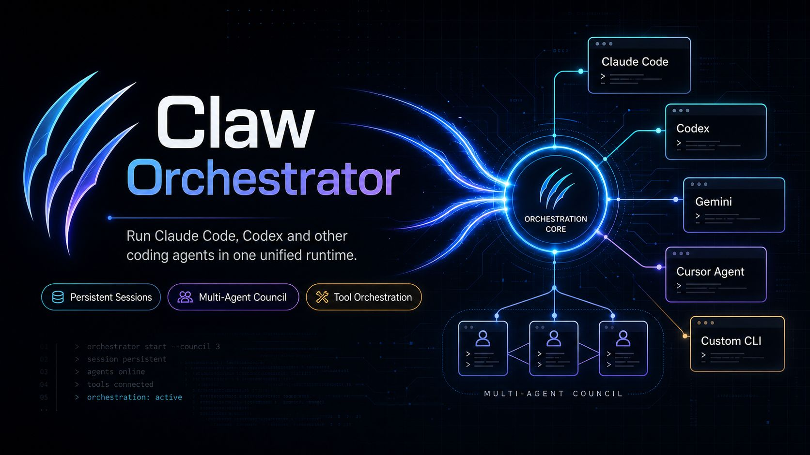

<p align="center">
  
</p>

# Claw Orchestrator

> A runtime for coding agents. Wrap Claude Code, Codex, Gemini, Cursor Agent, OpenCode, or any custom CLI as persistent programmable sessions; coordinate them in multi-agent councils; run autonomous Planner / Coder / Reviewer loops; or hand a five-question interview to an Opus council that ships a deployed web app at `localhost:19000/forge/<slug>/`.

[](https://www.npmjs.com/package/@enderfga/claw-orchestrator)
[](https://github.com/Enderfga/claw-orchestrator/actions/workflows/ci.yml)
[](https://opensource.org/licenses/MIT)

Coding CLIs are designed for humans at terminals. Claw Orchestrator turns them into headless engines and stacks an agent platform on top: a 65-tool API that scales from a single session call up to a fully generated, deployed web app — reachable through the CLI, the OpenClaw gateway, the Model Context Protocol, or directly from TypeScript, and visible through an embedded three-tab dashboard.


https://github.com/user-attachments/assets/fbd2b0ea-28d8-4387-9894-c29cf15ba030

<p align="center">
  <sub><b>Control · Council · Autoloop · Ultraapp</b> — the four movements in 35s</sub>
</p>

---

## Features

| Capability                  | What it does                                                                                                                                                                                                                    | Reference                                                  |
| --------------------------- | ------------------------------------------------------------------------------------------------------------------------------------------------------------------------------------------------------------------------------- | ---------------------------------------------------------- |
| **Persistent Sessions**     | Long-lived coding agents kept alive across requests, with full context, tool, model, and worktree control.                                                                                                                      | [`sessions.md`](./skills/references/sessions.md)           |
| **Multi-Engine Runtime**    | One interface over Claude Code, Codex, Gemini, Cursor Agent, OpenCode, and arbitrary custom CLIs.                                                                                                                               | [`multi-engine.md`](./skills/references/multi-engine.md)   |
| **Multi-Agent Council**     | Parallel agents in isolated git worktrees, voting on consensus until they agree.                                                                                                                                                | [`council.md`](./skills/references/council.md)             |
| **Fan-out**                 | Run one task across N engine/model agents in parallel and collect their answers, with an optional synthesis pass — the cross-engine best-of-N / diverse-perspective primitive (no rounds or worktrees).                          | [`tools.md`](./skills/references/tools.md)                 |
| **ultracode**               | `session_start({ ultracode: true })` lets Claude orchestrate a dynamic JS workflow and fan out to subagents per task (Claude engine).                                                                                            | [`tools.md`](./skills/references/tools.md)                 |
| **Autoloop**                | Three-agent autonomous workspace iteration. Chat with the Planner; it spawns Coder + Reviewer into a self-iterating subloop and pushes you on regression, target-hit, or decision points.                                       | [`autoloop.md`](./skills/references/autoloop.md)           |
| **Ultraapp**                | A three-agent Opus council turns a five-question interview into a deployed web app — Tailwind UI, BYOK, file-queue runtime, smoke test, all live at `localhost:19000/forge/<slug>/`.                                            | [`ultraapp.md`](./skills/references/ultraapp.md)           |
| **Embedded Dashboard**      | Three-tab UI for Autoloop, Council, and Forge with sidebar lifecycle controls, per-run live event streaming, and cookie-based auth via a `/login` redirect.                                                                     | [`dashboard.md`](./skills/references/dashboard.md)         |
| **OpenAI-Compatible Proxy** | `POST /v1/chat/completions` translates OpenAI requests into native Anthropic, OpenAI, and Google calls and streams responses back in OpenAI shape. Point any OpenAI-SDK client at the orchestrator without changing call sites. | [`openai-compat.md`](./skills/references/openai-compat.md) |

The full 65-tool surface is enumerated in [`tools.md`](./skills/references/tools.md).

---

## Quick Start

```bash
npm install -g @enderfga/claw-orchestrator
clawo serve   # dashboard at http://127.0.0.1:18796/dash
```

```ts
import { SessionManager } from '@enderfga/claw-orchestrator';

const manager = new SessionManager();
await manager.startSession({ name: 'fix-tests', engine: 'claude', cwd: '/project' });
const result = await manager.sendMessage('fix-tests', 'Fix the failing tests');
```

---

## Integrations

### Standalone CLI

```bash
clawo serve                                            # dashboard + HTTP server on :18796
clawo session-start fix-tests --engine claude --cwd .  # start a session
clawo session-send fix-tests "Fix the failing tests"   # send into it
```

Every command is documented in [`cli.md`](./skills/references/cli.md).

### OpenClaw Plugin

```bash
curl -fsSL https://raw.githubusercontent.com/Enderfga/claw-orchestrator/main/install.sh | bash
```

Installs via npm, registers the plugin in `~/.openclaw/openclaw.json`, restarts the gateway. All 65 tools become available to every OpenClaw agent.

### Model Context Protocol Server

```bash
npm install -g @enderfga/claw-orchestrator   # clawo-mcp is now on PATH
```

Register `clawo-mcp` with any MCP-compatible host: Hermes Agent, Claude Desktop, Cursor, Cline, Continue, Zed, Windsurf, Goose, and others. Per-host stdio-config snippets and the `CLAWO_MCP_TOOLS` allowlist for tight tool budgets are in [`mcp.md`](./skills/references/mcp.md).

---

## Engine Compatibility

| Engine       | CLI        | Tested Version |
| ------------ | ---------- | -------------- |
| Claude Code  | `claude`   | 2.1.178        |
| Codex        | `codex`    | 0.137.0        |
| Gemini       | `gemini`   | 0.43.0         |
| Cursor Agent | `agent`    | 2026.03.30     |
| OpenCode     | `opencode` | 1.1.40         |
| Custom CLI   | any        | —              |

Any coding CLI that runs as a subprocess can be wired up as a custom engine — see [`multi-engine.md`](./skills/references/multi-engine.md#custom-engine-enginecustom).

---

## Contributing

See [`CONTRIBUTING.md`](./CONTRIBUTING.md). Run `npm run build && npm run lint && npm run format:check && npm run test` before submitting.

## License

MIT — see [`LICENSE`](./LICENSE).
